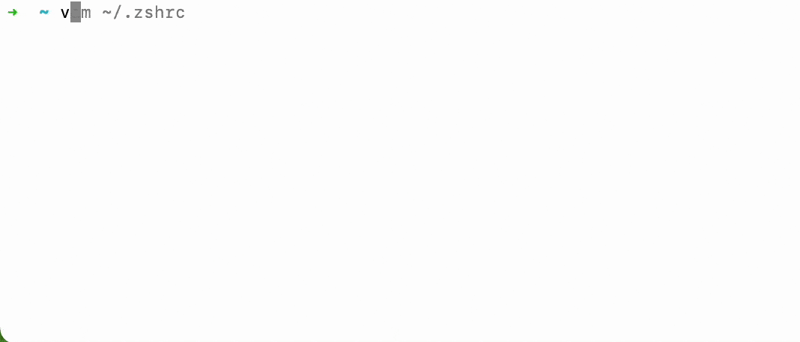

<p align="center" style="color: red">
    <h1 align="center">SV</h1>
    <p align="center">Switch golang version</p>
</p>

SV is a lightweight and beautiful Go Version Manager

**English** | [中文](./README.zh-CN.md)



## 🏆 Purpose
Allows you to easily build and switch different Golang versions

## ⬇️️ Install

### Linux / macOS

```bash
curl -sL https://raw.githubusercontent.com/voocel/sv/main/install.sh | sh
```

### Windows (PowerShell)

```powershell
irm https://raw.githubusercontent.com/voocel/sv/main/install.ps1 | iex
```

> After installation, open a **new terminal** for the changes to take effect.
>
> PowerShell note: `sv` is a built-in PowerShell alias for `Set-Variable`, which would shadow sv.exe. The installer overrides it in your PowerShell profile automatically; cmd and Git Bash need nothing.

## 🔥 Features
- List local or remote all versions (type `/` to filter)
- Install a specific version
- Uninstall a specific version
- Quickly switch local versions
- Pretty download progress bar
- Concurrent download with resume support
- SHA256 checksum verification for every download
- No admin rights required, including on Windows
- Prune old versions
- Check for outdated versions
- Self upgrade and self uninstall

## 🌲 Usage

**List and select a version to install**
```bash
sv list           # local versions
sv list -r        # remote versions
```

**Install specific version**
```bash
sv install 1.23.4
sv install --latest   # install latest stable version
```

**Switch to a version**
```bash
sv use 1.23.4
```

**Uninstall specific version**
```bash
sv uninstall 1.18.1
```

**Other commands**
```bash
sv current          # show current active version
sv latest           # show latest available version
sv outdated         # check if installed versions are outdated
sv where 1.23.4     # show installation path
sv prune            # remove old versions, keep recent ones
sv self upgrade     # upgrade sv itself
sv self uninstall   # uninstall sv and all Go versions
```

## 💡License

Copyright © 2016–2026

Licensed under [Apache License 2.0](/LICENSE)

## 🙋 Contributing

Welcome! Welcome!
